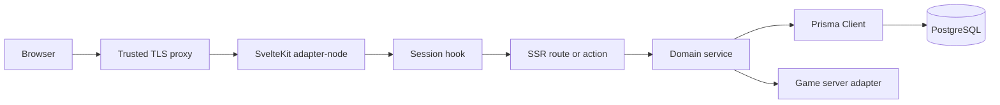

# Architecture

Wolves of Ragnarok is a single SvelteKit adapter-node application. SvelteKit owns SSR, public pages, server actions, JSON endpoints, authentication middleware, and administration. PostgreSQL is the system of record through Prisma 7 and the PostgreSQL driver adapter.

## Boundaries

- Route components render semantic HTML and receive only safe data.
- `src/lib/server/` owns secrets, persistence, hashing, uploads, and UDP queries.
- Form mutations use named SvelteKit actions. JSON endpoints are reserved for polling and external contracts.
- `hooks.server.ts` resolves session identity and enforces coarse route guards. Every mutation must also authorize locally.
- Game status is normalized behind `GameServerAdapter`; GameDig cannot leak into UI contracts.
- Bundled art and CMS uploads are deliberately separate.

## Request Flow

## Scaling

The first deployment is one web process with in-memory status TTL caching and persisted snapshots. If multiple instances become necessary, move cache/single-flight behavior to shared infrastructure before scaling horizontally. Redis, SSE, and WebSockets are intentionally absent in v1.
